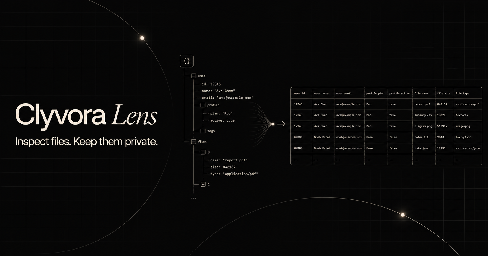

# Clyvora Lens

[](https://github.com/ClyvoraTech/Lens/actions/workflows/ci.yml)
[](LICENSE)

Clyvora Lens is a private, local-first workbench for inspecting, searching, filtering, and converting JSON and CSV files. It runs entirely in the browser: **your files never leave this device.**

**Use it online:** [www.lens.clyvora.tech](https://www.lens.clyvora.tech/)



> Clyvora Lens is currently beta software. Keep a copy of important source files and verify converted output before using it in critical workflows.

## Features

- Open `.json` and `.csv` files by dropping, choosing, or pasting data into an editable local input.
- Detect JSON and CSV using the filename and file contents.
- Explore JSON as a collapsible tree or formatted raw text.
- Search JSON keys and values, copy paths or subtrees, and download formatted JSON.
- Search, filter, and sort CSV data in a responsive table.
- Parse quoted fields, escaped delimiters, embedded newlines, empty cells, and duplicate headers.
- Convert CSV to typed JSON and choose table-shaped arrays inside nested JSON for CSV conversion.
- Flatten nested objects, preserve them as JSON text, or expand nested arrays into rows.
- Preview conversions and choose CSV delimiter, line ending, nested-object handling, and formula protection.
- Process large files off the main browser thread and warn before opening unusually large files.
- Respect keyboard navigation, visible focus states, and reduced-motion preferences.

## Privacy

File contents are parsed and transformed locally in your browser. Clyvora Lens has no backend, account system, analytics, cloud storage, advertising, external API, or AI integration. It does not log file contents.

The only browser storage used is `localStorage` for conversion preferences. See [PRIVACY.md](PRIVACY.md) for the full project privacy statement.

## Run locally

Requirements: Node.js 22.12 or newer and npm.

```bash
git clone https://github.com/ClyvoraTech/Lens.git
cd Lens
npm ci
npm run dev
```

Vite will print the local address to open in your browser.

## Quality checks

```bash
npm test
npm run lint
npm run build
```

The tests focus on JSON validation, format detection, CSV parsing, data profiling, and both conversion directions. Pull requests run the same checks automatically.

## Architecture

- `src/App.tsx` coordinates file intake, inspector state, and the workbench UI.
- `src/components/` contains the JSON tree and CSV table views.
- `src/lib/data.ts` contains parsing, validation, detection, analysis, and conversion logic.
- `src/workers/` moves expensive parsing, search, sorting, filtering, and conversion work off the main thread.
- `tests/` contains focused Vitest coverage for the data layer.
- `public/` contains local metadata artwork and the favicon; the app loads no remote assets.

## Contributing

Bug reports, focused improvements, accessibility fixes, and performance work are welcome. Please read [CONTRIBUTING.md](CONTRIBUTING.md), follow the [Code of Conduct](CODE_OF_CONDUCT.md), and use [SECURITY.md](SECURITY.md) for vulnerabilities.

## License

Clyvora Lens's original source code is source-available under the [PolyForm Shield License 1.0.0](LICENSE). Use, modification, and distribution are permitted except for providing a product that competes with Clyvora Lens or another product Clyvora provides using this software. This is not an OSI-approved open-source license. Versions previously published under MIT remain available under the MIT terms that accompanied those versions.
